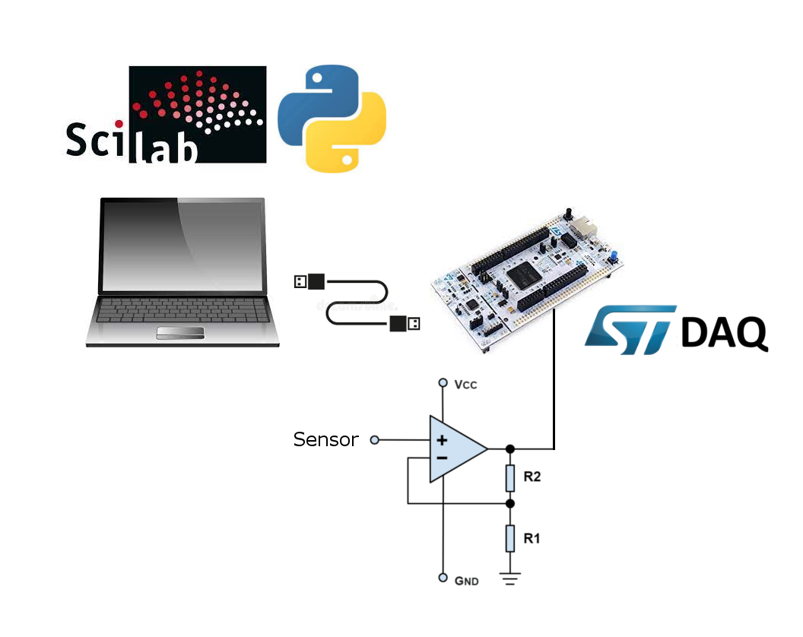

## An Affordable Data Acquisition System with an ST-Nucleo board and Scilab/Python programming interface

### Brief Description

stDAQ transforms an ST-NUCLEO board into an easy programmable and versatile data acquisition system (DAQ).
Environments like Scilab or Python running on a PC can be used to interact and program the stDAQ data acquisition. 
In the current version, the following peripherals are programmable on the ST NUCLEO-F413ZH board configured as a stDAQ:
- 1x 12 bits ADC with 14 multiplexed channel inputs
- 1x 12 bits DAC output
- 8x Digital Output pins
- 4x Digital Input pins
- 3x LEDs (RGB)
- 3x indipendent 16 bits PWM output pins
- 1x I2C interface 

More details about the programming, performance evaluation and the installation are available in the PDF reference manual, in the /docs/refman folder.

### Requirements & installation

For the current version of the stDAQ project, we use the ST NUCLEO-F413ZH board; 
this can be bought here <a href="https://www.digikey.com/en/products/detail/stmicroelectronics/NUCLEO-F413ZH/6559189"> NUCLEO-F413ZH</a> for about 20$.
The NUCLEO-F413ZH board needs to be flushed with the binary file provided in the nucleo/ folder, see instruction in reference manual.
Install <a href="https://www.scilab.org/"> Scilab </a>, launch it and run the scilab/runme.sci script to load the stDAQ library into the environment (currently tested only with v6.0.2 on Windows 8.1).

### Release updates

> Release (Antille) r.1.1

    - Added support to I2C read/write
    - Completed pinout assignment and reference in manual
    - Reduced latency for stdaq_get_adc() down to 1 msec.
    - Added example in ADC section
    
------------------------------------------------------------------------------------
MIT license.
stDAQ (c) 2021, Silvano Furlan.

